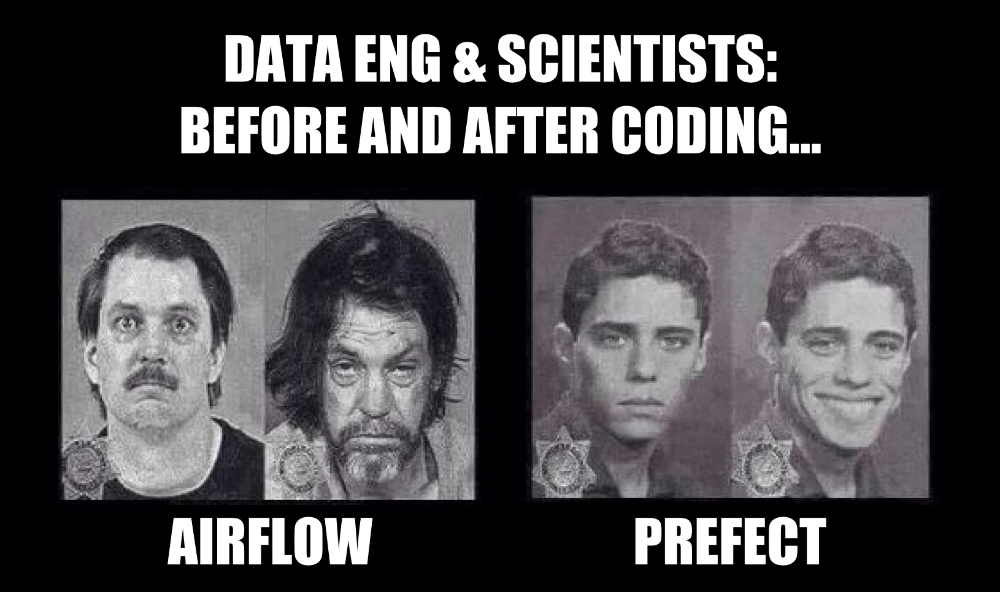
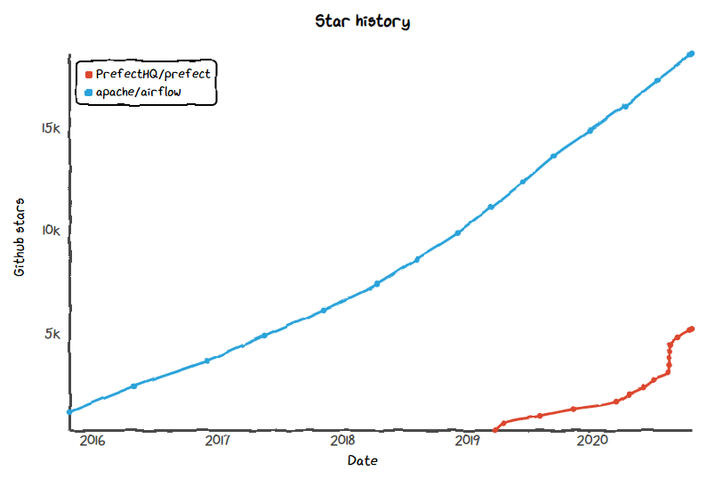
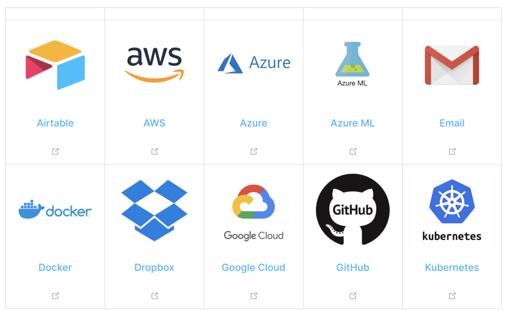

# Prefect (50 minutes)  




## Objectif
Présentation du framework (Prefect)[https://www.prefect.io/] comme solution d'orchestration de pipelines.  


## Déroulé
- Tour de table de ce que les gens connaissent comme équivalent (10 min)
- Hands-on Prefect: "flow" évolutif (30 min) 
- Concepts avancés en vrac et discussions (10 min) 

## Prérequis

- un environnement python >= 3.8
- y installer prefect `pip install prefect`
- un éditeur quelconque

A lire, pour ceux qui sont motivés :

- [why-not-airflow](https://medium.com/the-prefect-blog/why-not-airflow-4cfa423299c4?source=collection_home---4------1-----------------------) (17min)
- [pipeline-pitfalls](https://medium.com/the-prefect-blog/pipeline-pitfalls-57fe558cd76) (9min)
- [the-prefect-hybrid-model](https://medium.com/the-prefect-blog/the-prefect-hybrid-model-1b70c7fd296)  (8 min)
- [Prefect par Ippon (en Français)] (https://blog.ippon.fr/2020/06/08/prefect-workflow-automation-part1/) (10 min)

## Atelier 

### Introduction de concepts
- Positive Enginering : 
- Task 
- Flow
- Agent, Worker, Scheduler, ... 

### Hello world évolutif  

0. définition d'un ETL 
1. Paralléllisme  
2. Paramètrage
3. Erreurs & Triggers
4. Hooks (ex : Slack)
5. Planification 
6. Monitoring avec la UI (Server)
7. Passagge à l'échelle avec Dask

### Prefect vs. Airflow 


#### Prefect
```
@task
def push_task():
  return {"Firstname": "Hello", "Name": "World"}

@task
def pull_task(pulled_value):
  print("Received value: {}".format(pulled_value))

with Flow("XCom demo") as flow:
  # declaration de la relation : push_task() s execute en premier et pull_task() en deuxieme
  v1 = push_task()
  pull_task(v1) # on passe directement la valeur v1 en arguments qui a ete retournee par push_task()

```
#### Airflow
```
def push_task(**kwargs):
  return {"Firstname": "Hello", "Name": "World"}

def pull_task(**kwargs):
  # nous sommes censes recuperer dans les kwargs la valeur qui a ete push par une tache push_task()
  pulled_value = kwargs['ti'].xcom_pull(key=None, task_ids='push_task')
  print("Received value: {}".format(pulled_value))

with DAG("xcom_dag", default_args=default_args, schedule_interval="@once", catchup=False) as dag:
  push_task = PythonOperator(task_id="push_task", python_callable=push_task)
  pull_task = PythonOperator(task_id="pull_task", python_callable=pull_task, provide_context=True)

  # declaration de la relation : push_task() s execute en premier et pull_task() en deuxieme
  push_task >> pull_task
```

### Discussions

#### Aller plus loin 
- Prefect propose une  [bibliothèque de tâches](https://docs.prefect.io/api/latest/#task-library)
 très complète qui inclut des implémentations et des intégrations de tâches pour que vous puissiez facilement interagir avec vos applications externes (K8s, AWS, Docker, Snowflake...).
 
 - Architechture Server ([documentation  ici](https://docs.prefect.io/orchestration/server/architecture.html))

- Prefect UI (juste un screenshot car très cool) 


#### Go, No-Go

- **Go :** Automatisation de pipeline de traitement de données Python hors-ligne (Airflow, ... )
- **No-Go :** En ligne (Kafka, ELK) - .. quoi que cf [Pin 14](https://docs.prefect.io/core/PINs/PIN-14-Listener-Flows-2.html), fonctions non python

